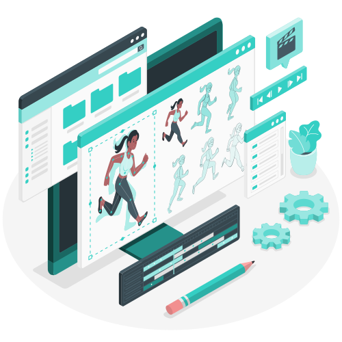

### Hi there 👋

My name is Ryan Large, I have claimed this spot on github
to have a secure fun and productive way to store the code
for the projects I start and projects I finish.
 
 

Most of my time is spent Engineering websites for all kinds of things
and sadly the least amount of my time is developing my skills in UI/UX design
but I am working on that as well!

  

Directly below you will see my favorite projects 
that I am currently building upon and some that I have finished.
I love to code and my knowledge base is increasingly increasing
all the way from the world of Web Development, to Mobile App & around the
corner to Robotics and Desktop Applications.

## What I am currently working on..

## What languages, frameworks & Libraries I spend the most time with...  

      
 
       
 
   

## Operating Systems 

## How to Reach Me! 👇
 
 

